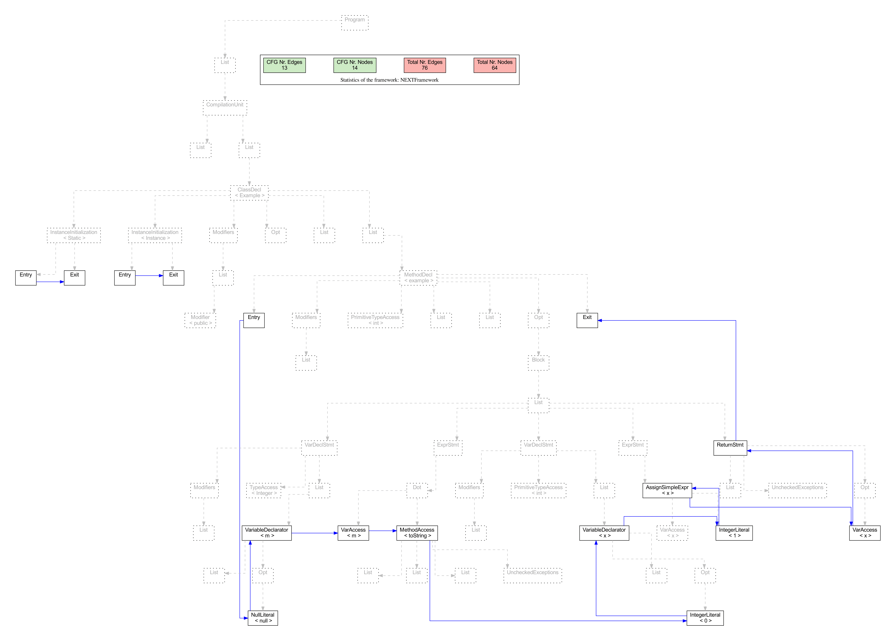

[](https://github.com/lu-cs-sde/IntraJ/actions/workflows/main.yml)
<p align="center">
  
</p>

---

**IntraJ** is an application of the language independent framework **[IntraCFG](https://github.com/lu-cs-sde/IntraCFG)** for the Java language, build as an extension of the **[ExtendJ](https://extendj.org)** Java Compiler. More details can be found in the following paper:
* __[A Precise Framework for Source-Level Control-Flow Analysis](https://github.com/lu-cs-sde/IntraJSCAM2021/blob/main/intraj-preprint.pdf)__, _[Idriss Riouak 🔗](https://github.com/IdrissRio), [Christoph Reichenbach 🔗](https://creichen.net), [Görel Hedin 🔗](https://cs.lth.se/gorel-hedin/) and [Niklas Fors 🔗](https://portal.research.lu.se/portal/en/persons/niklas-fors(c1e9efdd-5891-45ec-aa9d-87b8fb7f3dbc).html)_. _[IEEE-SCAM 2021 🔗](http://www.ieee-scam.org/2021/#home)._ 
<p float="left" align="center">
<a href="https://icsme2021.github.io/cfp/AEandROSETrack.html">
   </a>
  <a href="https://icsme2021.github.io/cfp/AEandROSETrack.html"> </a>
</p>
---

With **IntraJ** you can:
- construct intra-procedural **Control Flow Graph**,
- (*DAA*) detect **Dead assignments** in your codebase,
- (*IMPDAA*) detect **Implicit dead assignments** in your codebase, and
- (*NPA*) detect occurences of **NullPointerException**.


You can run IntraJ on other Java codebases (in Java-4, Java-5, Java-6, Java-7 and Java-8 (WIP)) in order to construct CFGs and get DAA and NPA analysis results.


# Build IntraJ from the source code
## Prerequisites

We have run IntraJ on the following Java version:

*  **Java SDK version 8**. (tested with  Java OpenJDK 1.8.0_275. See [sdkman](https://sdkman.io)).

It is possible to generate PDFs that show the CFGs visually. For this you need:
1) **Dot** (graphiz) - _PDF generation_
2) **Vim** - _PDF generation_
3) **Python3.x** with the following dependencies:
    * **PyPDF2 v1.26.0** - _PDF generation_
    * **numpy v1.20.1** - _Evaluation and Plots generation_
    * **pandas v1.2.4** - _Evaluation and Plots generation_
    * **matplotlib v3.3.4** - _Evaluation and Plots generation_
    * **seaborn v0.11.1** - _Evaluation and Plots generation_
    * **ipython v7.26.0** - _Evaluation and Plots generation_


The evaluation script uses `sdkman`.
To run the evaluation you need:
* The scripts `eval.sh` and `evaluation/run_eval.sh` uses `sdkman`. If you don't have `sdkman` installed but have Java SDK 8 installed, you can comment all the lines starting with `sdk` in `eval.sh` and in `evaluation/run_eval.sh`. You install `sdkman` by running the following commands:

  ```
  curl -s "https://get.sdkman.io" | bash
  source "$HOME/.sdkman/bin/sdkman-init.sh"
  sdk install java 7.0.292-zulu
  sdk use java 7.0.292-zulu
  ```

To install all the necessary Python dependencies, you can run the instruction described in the next section.


## Build
To clone the **IntraJ** code, run, in your working directory:
```
git clone https://github.com/lu-cs-sde/IntraJ.git
```

Move to the **IntraJ** directory:

```
cd IntraJ
```

To generate all the JARs necessary for the evaluation, execute

```
./gradlew build
```

To run all the tests, execute:

```
./gradlew test
```

### Python Dependencies

To install Python dependencies, you can execute the following instruction:

```
cd resources
pip3 install - requirements.txt
```

---


### Repository overview
The top-level structure of the repository:

    .
    ├── build                                # Compiled files
    ├── evaluation                           # Scripts and dependencies for evaluation
    ├── extendj                              # ExtendJ source code
    ├── resources                            # Scripts and logo
    ├── src                                  # IntraJ source code
    |    ├── jastadd                  
    |    |     ├── CFG                       # CFG spec in Jastadd
    |    |     └── DataFlow                  # Data flow analyses spec
    |    └── java
    |          ├── utils                     # General helpers for visualisation
    |          └── 
    # JUnit test spec
    ├── tools                                # IntraJ source code
    |    └── jastadd-2.3.6-custom            # Custom version of Jastadd
    ├── testfiles                            # Automated test files
    |    ├── DataFlow
    |    └── CFG
    ├── eval.sh                              # Evaluation entry point
    ├── LICENSE
    └── README.md

The _entry point_ of **IntraJ** (main) is defined in:
`extendj/src/fronted-main/org/extendj/IntraJ.java`.


### The _evaluation_ folder
The directory is structured as follow:

    .
    ├── antlr-2.7.2                          # ANTLR Benchmark                  (Paper §5)
    ├── pmd-4.2.5                            # PMD Benchmark                    (Paper §5)
    ├── jfreechar-1.0.0                      # JFC Benchmark                    (Paper §5)
    ├── fop-0.95                             # FOP Benchmark                    (Paper §5)
    ├── Results.xlsx                         # Analyses results in Excel        (Paper §5)
    ├── Results.htm                          # Analyses results in HTML
    ├── plots.py                             # Script that generates plots
    ├── run_eval.sh                          # Called by ../eval.sh
    └── YYYYMMDD_HHMMSS                      # Evaluation results


### The _jastadd_ folder

    .
    └── jastadd
         ├── CFG
         |    ├── IntraCFG
         |    |    ├── CFG.ast                # Lang-independent nodes
         |    |    └── IntraCFG.jrag          # IntraCFG spec in Jastadd        (Paper §2.b)
         |    ├── java4                       #                                 (Paper §3)
         |    |    ├── Cache.jrag             # Cache settings
         |    |    ├── Exception.jrag         # Exception spec                  (Paper §3.c)
         |    |    ├── Initializer.jrag       # Initializers spec               (Paper §3.b)
         |    |    ├── Java4.jrag             # Java4 spec
         |    |    └── ImplictNodes.ast       # Reified nodes
         |    ├── java5                       #                                 (Paper §3)
         |    |     └── Java5.jrag            # Java5 spec
         |    └── java7                       #                                 (Paper §3)
         |          └── Java7.jrag            # Java7 spec
         └── DataFlow                         # Data flow analyses spec         (Paper §4)
               ├── Analysis.jrag              # Collection attributes
               ├── DeadAssignment.jrag        # DAA spec                        (Paper §4.c)
               ├── LiveVariableAnalysis.jrag  # LVA spec                        (Paper §4.b)
               └── NullAnalysis.jrag          # NPE sepc                        (Paper §4.a)
---

| ⚠️ Note          |
|:---------------------------|
|There is no subdirectory for `java6`, since features introduced in Java 6 do not affect the construction of the CFG. |


## Available options to IntraJ:
  - `-help`: prints all the available options.
  - `-genpdf`: generates a pdf with AST structure of all the methods in the analysed files. It can be used combined with `-succ`,`-pred`.
  - `-succ`: generates a pdf with the successor relation for all the methods in the analysed files. It can be used combined with `-pred`.
  - `-pred`: generates a pdf with the predecessor relation for all the methods in the analysed files. It can be used combined with `-succ`.
  - `-statistics`: prints the number of _**CFGRoots**_, _**CFGNodes**_ and _**CFGEdges**_ in the analysed files.
  - `-nowarn`: the warning messages are not printed.

-------------- _ANALYSIS OPTIONS_ --------------------

Available analyses:
  * `DAA`: Detects unused dead assignments
  * `NPA`: Detects occurrences of Null Pointer Dereferencing

Options (where `id` corresponds to one of the analyses above):
   - `-Wid`: enable a given analysis, e.g., `-WDAA`
   - `-Wall`: enables all the available analyses
   - `-Wexcept=id`: enable all the available analyses except `id`, e.g., `-Wexcept=DAA`

---

# Example of running IntraJ

Suppose you would like to analyze a file `Example.java` located in your workspace:
```
public class Example {
  int example() {
    Integer m = null;
    m.toString();
    int x = 0;
    x = 1;
    return x;
  }
}
```
By running the following command:

```
    java -jar intraj.jar PATH/TO/Example.java -Wall -succ -statistics
```

**IntraJ** will print the following information
```
[NPA - PATH/TO/Example.java:4,4] The object 'm' may be null at this point.
[DAA - PATH/TO/Example.java:5,9] The value stored in 'x' is never read.
[INFO]: CFG rendering
[INFO]: DOT to PDF
[INFO]: PDF file generated correctly
[STATISTIC]: Elapsed time (CFG + Dataflow): 0.11s
[STATISTIC]: Total number
[STATISTIC]: Number roots:3
[STATISTIC]: Number CFGNodes:16
[STATISTIC]: Number Edges:13
[STATISTIC]: Largest CFG in terms of nodes:12
[STATISTIC]: Largest CFG in terms of edges:11
```

And the following PDF is generated:



---
# Related repository repositories/links 🔗
 - 🗄 **[IntraJ-LSP](https://github.com/IdrissRio/IntraJ-LSP.git): repository for the Language Server Protocol (LSP) implementation of IntraJ.
 - 🗄 **[CodeProber](https://github.com/Kevlanche/codeprober-playground): live inspection of IntraJ's attributes in CodeProber.
 - 🗄 **[IntraJSCAM2021](https://github.com/lu-cs-sde/IntraJSCAM2021)**: repository submitted for Artifact Evaluation (SCAM2021) (control-flow analysis for Java)
 - 🗄 **[IntraCFG](https://github.com/lu-cs-sde/IntraCFG)**: main repository for IntraCFG (language-independent framework for control-flow analysis)
 - 🔗 **[JastAdd](https://jastadd.org)**: meta-compilation system that supports Reference Attribute Grammars. We used a custom [JastAdd](https://bitbucket.org/jastadd/jastadd2/src/f00c118684f4cc9b42931b5a491046e41d68b6bf/) version which better supports interfaces.
 - 🔗 **[ExtendJ](https://extendj.org)**: extensible Java compiler built using JastAdd. We built **IntraJ** as an Static Analysis Extension of ExtendJ. More can be found [here](https://bitbucket.org/extendj/analysis-template/src/master/). 
 - 🔗 **[SonarQube](https://www.sonarqube.org/downloads/)**: platform developed by SonarSource for continuous inspection of code quality
 - 🗄 **[JastAddJ-Intraflow](https://bitbucket.org/jastadd/jastaddj-intraflow/src/master/)**: An earlier approach to implementing intra-procedural control flow, dataflow, and dead assignment analysis for Java, also using JastAdd.
 

